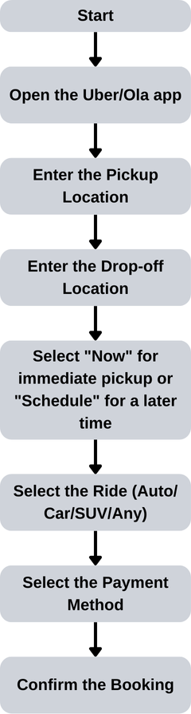
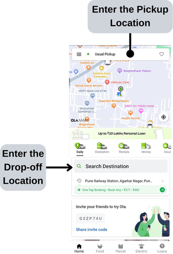
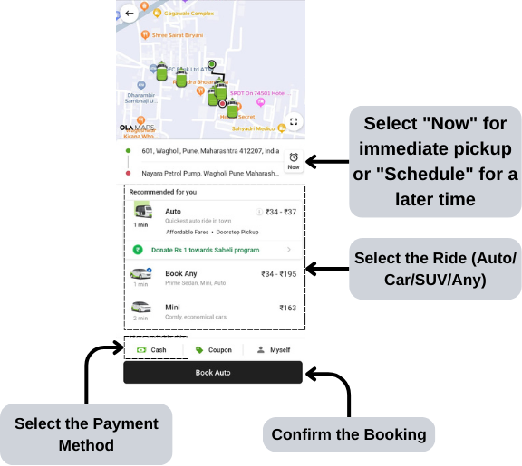

Here’s the updated **Instruction Guide** with image tags in the pickup and drop-off steps and a title for the flowchart:

---

# How to Book a Cab Using the Ola App

This guide will walk you through the process of booking a cab using the Ola mobile app. Follow the steps below to quickly and easily get your ride.

## Flowchart: Ola Cab Booking Process

The following steps illustrate the process of booking a cab through the Ola app, from setting your location to completing payment.

  
---

## Prerequisites
- You must have the **Ola app** installed on your mobile device.
- You need an active **Ola account** with a verified phone number and a valid payment method (e.g., credit/debit card, digital wallet).
- Ensure your phone has an active **internet connection** and **location services** enabled.

---

## Steps to Book a Cab

### 1. **Open the Ola App**
   - Launch the Ola app on your mobile device.
   - If you are not logged in, log in using your phone number and the OTP (One-Time Password) sent to your device.

### 2. **Set Your Pickup Location**
   - The app will automatically detect your current location using GPS. If the location is incorrect or if you want to be picked up from a different place, tap on the **"Pickup Location"** field to manually set the correct address.
   -   
   - You can also use the map to adjust your pickup point by dragging the pin to the desired location.

### 3. **Choose Your Drop Location**
   - Tap on the **"Drop Location"** field and type in your destination. You can search for a location by name (e.g., a restaurant, office) or enter an address manually.
     - The app may show you suggested destinations based on your previous rides or saved addresses.

### 4. **Select a Cab Category**
   - The app will show various cab categories like **Mini**, **Prime Sedan**, **Prime SUV**, or **Auto**. Choose the one that fits your budget and preferences.
   -  
   - The estimated fare for each category will be displayed. Review the pricing before proceeding.

### 5. **Schedule the Ride (Optional)**
   - If you need a cab for later, tap the **"Ride Later"** button to schedule a ride in advance. Set the desired pickup date and time, then confirm.

### 6. **Confirm the Ride**
   - After selecting your pickup and drop locations and cab category, review the ride details, including fare estimates and payment method.
   - Tap the **"Confirm Booking"** button to request the ride.

### 7. **Track Your Cab**
   - Once your ride is confirmed, the app will assign a driver to you. You can see the driver's details, including their name, photo, vehicle number, and estimated time of arrival (ETA).
   - You can track the cab's location in real time on the map as it approaches your pickup point.

### 8. **Meet Your Driver**
   - When the cab arrives at the pickup location, the driver may call you to confirm your location. Double-check the vehicle number and driver details to ensure they match the information in the app.

### 9. **Start Your Ride**
   - Once you're in the cab, the driver will start the ride and take you to your destination.
   - You can view your trip details, including the current route, fare estimate, and ETA, throughout the ride.

### 10. **Complete Payment**
   - After reaching your destination, the app will calculate the final fare based on distance and time.
   - The payment will be automatically deducted if you have a linked payment method (e.g., credit card, Ola Money). Otherwise, you can pay the driver using cash or an alternate payment method.

### 11. **Rate Your Ride**
   - After the ride is completed, you will be prompted to rate your experience and provide feedback. Your ratings help maintain the quality of service.

---

## Troubleshooting

- **Issue with GPS:** If the app can't detect your location, ensure that your phone's GPS/location services are turned on. You can also manually enter your pickup point.
- **No Cabs Available:** If there are no cabs nearby, try selecting a different cab category or checking again after a few minutes.
- **Payment Issues:** If payment fails, you can update your payment method by going to the **"Payments"** section in the app settings.

---

## Contact Support

If you encounter any issues during your ride or booking, you can contact Ola customer support directly through the app by navigating to **"Help"** from the main menu.

---

Now you're ready to book your Ola cab easily using the steps outlined above!
